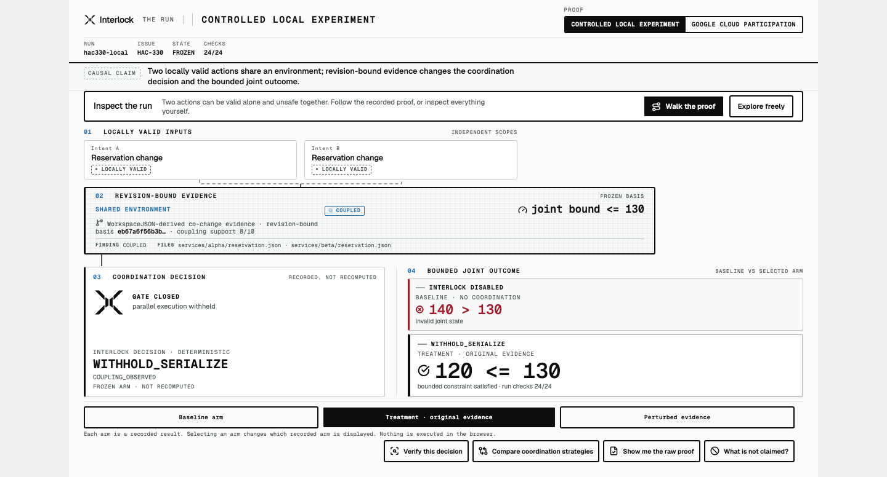

<!--
  The theme-fixed lockups, not the `currentColor` one: a markdown  loads
  the SVG as its own sandboxed document with no inherited `color`, so
  `currentColor` resolves to black and the mark disappears against a dark README.
-->
<picture>
  <source media="(prefers-color-scheme: dark)" srcset="assets/logo/interlock-lockup-horizontal-white.svg">
  
</picture>

# Two good agent decisions can still make one bad system decision.

One agent raises the reservation on service `alpha`. Another agent raises the
reservation on service `beta`. Different services, different files, different
lock keys — and each change is correct when you look at it on its own.

They share one environment, and that environment has a ceiling. Applied
together, the result is over it.

A per-target lock coordinates contention on a target. It cannot coordinate a
relationship that is not either target.

**Interlock reads the environment evidence that describes that relationship, and
makes a coordination decision before anything mutates.**

---

## The failure, concretely


Two intents. Each valid on its own. One shared environment, bounded by
`sum(services[].reserved) <= 130`.

| | Interlock disabled | Interlock enabled |
| -- | -- | -- |
| Decision | *no decision* | `WITHHOLD_SERIALIZE` |
| Joint outcome | `140 > 130` — invalid joint state | `120 <= 130` — bounded constraint satisfied |

Checks: **24/24**. This is a bounded controlled experiment recorded under
**HAC-330**, and it ran locally — not on Google Cloud.

## Why the obvious fix does not catch this one

Per-target locking is the right tool for same-target contention, and it is a
real baseline here rather than a straw man. On the same frozen corpus it
serialized same-target contention 2/2 and it parallelised cross-target pairs 4/4.
It locked exactly what a lock can see, and it kept the concurrency that a global
lock would have destroyed.

It still missed the coupled cross-target hazards 2/2.

Two different lock keys do not imply two independent effects. The constraint
these intents break is not `alpha`'s key and not `beta`'s key — it belongs to the
environment both keys sit in, and a per-key discipline has no key for it.

## What Interlock adds

Before shared state is touched:

1. Two independently valid intents arrive.
2. Interlock reads **revision-bound environment evidence** — evidence about how
   parts of this environment actually move together, bound to the revision it
   was true at.
3. It asks whether these two targets' effects are coupled through a constraint
   that neither target owns.
4. It selects a coordination decision — let both proceed, or hold one back and
   order them — **before** the mutation, not after.
5. On the protected path the target refuses the mutation unless it is presented
   with the authorization receipt that decision issued, and validates that
   receipt itself.

The two decisions above appear in the record as `ALLOW_PARALLEL` — both intents
proceed at once — and `WITHHOLD_SERIALIZE` — one intent is held back while the
other proceeds alone. A held intent is not an approval, a rejection, or a human
sign-off; it is a coordination decision.

## Compared with what?

Four mechanically distinct coordination strategies, run against
one frozen sixteen-scenario corpus (**HAC-343**). Exact counts, because the
corpus is an exhaustive enumeration rather than a sample:

| Strategy | Coupled hazards that ended invalid | Independent opportunities kept parallel |
| --- | --- | --- |
| Uncoordinated | 2/2 | 2/2 |
| Global lock | 0/2 | 0/2 |
| Per-target lock | 2/2 | 2/2 |
| Interlock | 0/2 | 2/2 |

Fewer is better in the first column; more is better in the second.

Global locking bought safety by eliminating concurrency. Per-target locking kept
the concurrency and missed both coupled hazards. Interlock is the only arm in
both left-hand columns at once — **on this corpus**.

These are counts over an exhaustive enumeration of constructed scenarios in two
hazard families, not rates over a population. Nothing here is a sample, an
estimate, or an interval.

## The evidence is load-bearing


The environment evidence is not decorative context. Hold the intents and the
final tree identical and remove only the recorded coupling from the history, and
the deterministic decision reverses to `ALLOW_PARALLEL`:

| Condition | Invalid outcomes |
| --- | --- |
| Interlock + coupling evidence present | 0/2 |
| Interlock + coupling evidence removed | 2/2 |

The safety in the table above is the evidence's, not the engine's. Both
conditions are **recorded results** — run once, offline, and frozen. Nothing is
executed to produce this comparison.

Every figure in these two tables is read from
[`experiments/hac-343/evidence/judge-export.json`](./experiments/hac-343/evidence/judge-export.json),
anchored at canonical result `7ede0f9`.

## Where this sits in an agent fleet

Interlock is the **pre-mutation composition-safety boundary** for a multi-agent
fleet: the point where independently valid actions are coordinated when shared
environment evidence says their effects are coupled, and where a protected
mutation is gated on the receipt that decision produced.

That is the whole of the role it claims. It is not an agent registry, not agent
memory, not a fleet catalogue, not a task-delegation layer and not an enterprise
governance plane. Those are adjacent problems this submission did not solve.

---

## Start here

### See it

| | |
| -- | -- |
| The Run — deployed judge cockpit | <https://interlock.marcellelabs.io/cockpit> |
| Treatment arm | [`?run=hac330-local&proof=local&state=run.local.treatment`](https://interlock.marcellelabs.io/cockpit?run=hac330-local&proof=local&state=run.local.treatment) |
| Perturbed arm | [`?run=hac330-local&proof=local&state=run.local.perturbed`](https://interlock.marcellelabs.io/cockpit?run=hac330-local&proof=local&state=run.local.perturbed) |
| The recorded Google Cloud run | [`?run=hac340-cloud&proof=cloud&state=run.cloud.overview`](https://interlock.marcellelabs.io/cockpit?run=hac340-cloud&proof=cloud&state=run.cloud.overview) |
| Forensic replay of the composition, as coded motion | [`IL-MOT-021-forensic-replay-1920x1080.mp4`](./media/hac-350/exports/IL-MOT-021-forensic-replay-1920x1080.mp4) |

Append `&static=1` for the reduced-motion resolution. The cockpit is a
verification surface over frozen evidence: nothing in it executes, and every
value is read out of a recorded packet.

### Verify it

| | |
| -- | -- |
| Bounded four-arm evaluation | [`experiments/hac-343/evidence/`](./experiments/hac-343/evidence/) — `pnpm check:packet:eval` |
| Controlled local experiment packet | [`experiments/hac-330/evidence/`](./experiments/hac-330/evidence/) — `pnpm check:packet` |
| Public cloud evidence packet | [`experiments/hac-342/evidence/`](./experiments/hac-342/evidence/) — `pnpm check:packet:public` |
| Every gate at once | `pnpm run check` |

### Understand the deployment

| | |
| -- | -- |
| Deployment and trust boundaries | [`IL-DIAG-012`](./media/hac-334/exports/IL-DIAG-012-deployment-trust-boundaries-1920x1080-runilkhac340cloud1786730369123.png) |
| The recorded Google Cloud traversal | [`IL-DIAG-011`](./media/hac-334/exports/IL-DIAG-011-cloud-participation-1280x720-runilkhac340cloud1786730369123.png) |
| Enforcement topology | [`docs/architecture/enforcement-topology.md`](./docs/architecture/enforcement-topology.md) |
| Provenance and what may be claimed | [`DISCLOSURE.md`](./DISCLOSURE.md) · [`provenance/manifest.json`](./provenance/manifest.json) |

### Reproduce it

[Reproducing and building](#reproducing-and-building), below — what runs from
this checkout alone, and what needs the sibling workspace.

## Can I verify it locally?



<sub>Real capture of `media/hac-341/cockpit.html?run=hac330-local&proof=local&state=run.local.treatment` at 1440×900, cropped to the rendered content.</sub>

Serve the repository root — the cockpit resolves its identity assets from
`/assets` — and open the deep links:

```sh
python3 -m http.server 4173
```

| | |
| -- | -- |
| Treatment | [`?run=hac330-local&proof=local&state=run.local.treatment`](http://127.0.0.1:4173/media/hac-341/cockpit.html?run=hac330-local&proof=local&state=run.local.treatment) |
| Baseline | [`?run=hac330-local&proof=local&state=run.local.baseline`](http://127.0.0.1:4173/media/hac-341/cockpit.html?run=hac330-local&proof=local&state=run.local.baseline) |
| Perturbed | [`?run=hac330-local&proof=local&state=run.local.perturbed`](http://127.0.0.1:4173/media/hac-341/cockpit.html?run=hac330-local&proof=local&state=run.local.perturbed) |
| Google Cloud run | [`?run=hac340-cloud&proof=cloud&state=run.cloud.overview`](http://127.0.0.1:4173/media/hac-341/cockpit.html?run=hac340-cloud&proof=cloud&state=run.cloud.overview) |

---

# Context reset — different run, different evidence

**Everything above is the controlled local experiment (HAC-330).** What follows
is a separate recorded run on Google Cloud (HAC-340). Neither is evidence for
the other, and no single run produced both. The first establishes the bounded
causal comparison; the second establishes that the protected Interlock path was
also exercised using the required Google stack.

---

## Google Cloud participation


One recorded traversal:

`gemini-3.5-flash` → **Google ADK 1.35.1** / Vertex AI → Cloud Run-hosted agent
(`us-central1`) → **Interlock MCP proxy** → `ALLOW` + authorization receipt →
protected target mutation `EXECUTED` → independently authenticated read-back
`OBSERVED alpha=45` → Cloud Logging correlated by run id.

`EXECUTED` and `OBSERVED` are separate facts: one is what the mutation reported,
the other is what a separately authenticated principal read back afterwards.

The Google technologies on that recorded path, and nothing else, are listed in
[`media/hac-335/devpost/04-google-technologies.md`](./media/hac-335/devpost/04-google-technologies.md).

### Fail-closed controls

| Control | Result |
| -- | -- |
| Forged identity header | `403` |
| Invalid bearer token | `401` |
| Direct target bypass without receipt | `403` |

Three recorded refusals. That is three controls, not comprehensive attack
coverage.

## Where does Google end and Interlock begin?


Cloud Run IAM establishes **transport provenance** — who called. The Interlock
decision and receipt are **application provenance**. These do not collapse into
one another, and internal Interlock roles are not Google-managed identities.

`interlock-hac340-proxy-00002-wzf` is the only deployment revision the frozen
record names. Agent and target revision names are not evidenced and are not
shown.

**Agent Runtime, Agent Gateway and CONTENT_AUTHZ are not on this path.**

## Verify the evidence

The cloud run is published immutably, pinned to a commit rather than a branch.

| | |
| -- | -- |
| Cloud evidence packet | [`cloud-run.public.json`](https://github.com/Marcelle-Labs/interlock/blob/75253e38791e69f7e2a4bb3a041044a9114c32f0/experiments/hac-342/evidence/cloud-run.public.json) |
| Independent verifier | [`verify-public-packet.mjs`](https://github.com/Marcelle-Labs/interlock/blob/75253e38791e69f7e2a4bb3a041044a9114c32f0/experiments/hac-342/bin/verify-public-packet.mjs) |
| Redaction manifest | [`redaction-manifest.json`](https://github.com/Marcelle-Labs/interlock/blob/75253e38791e69f7e2a4bb3a041044a9114c32f0/experiments/hac-342/evidence/redaction-manifest.json) |
| Runtime source snapshot | [`runtime-source-snapshot.json`](https://github.com/Marcelle-Labs/interlock/blob/75253e38791e69f7e2a4bb3a041044a9114c32f0/experiments/hac-342/evidence/runtime-source-snapshot.json) |
| Publication bindings | [`publication-bindings.json`](https://github.com/Marcelle-Labs/interlock/blob/9da4cb95b6eec6030fe0c622b67a319eeaf20230/experiments/hac-342/evidence/publication-bindings.json) |

Recompute the packet digest yourself:

```sh
curl -sL https://raw.githubusercontent.com/Marcelle-Labs/interlock/75253e38791e69f7e2a4bb3a041044a9114c32f0/experiments/hac-342/evidence/cloud-run.public.json \
  | shasum -a 256
# ea1d6993ca937bb5ae14ad43954e48bd1a91ceb5e959719f8a99492b0b0dbf0d
```

Two digests in that record are deliberately **not** reader-recomputable, and the
package says so rather than implying otherwise:

- `sourcePacketSha256` `794befb8…` is a private commitment. The source bytes are
  unpublished.
- `runtimeSourceSha` `ae6d0d3c…` has **no public URL**. Its tree contains an
  identifier excluded from publication, so no revision link is fabricated; the
  public snapshot records the executed source content instead, across 36 files,
  under `runtimeSourceSnapshotSha256` `9aaa4ad1…`.

## Claim boundary


**Controlled local experiment (HAC-330)** — a bounded causal experiment:
revision-bound environment evidence changes the coordination decision and the
joint outcome.

**Google Cloud participation (HAC-340)** — one recorded Gemini + Google ADK +
Cloud Run traversal through Interlock, a receipt-bound protected mutation,
independently read back and correlated in Cloud Logging.

**Bounded operational utility (HAC-343)** — the four-arm comparison and the
evidence ablation shown above, over one frozen corpus. The per-target lock in it
is a credible baseline, not a straw man: a composition hazard spanning two lock
keys is invisible to any per-key discipline, and the figures that establish that
are in [Why the obvious fix does not catch this one](#why-the-obvious-fix-does-not-catch-this-one).

Interlock is **not** 0% unsafe — it produced invalid joint states in both
ablation scenarios by design — and it is **not** "safer than locking": per-target
locking is correct for the hazard it addresses.

**Not claimed.** HAC-330 did not run on Google Cloud, and HAC-340 does not
reproduce the 140/120 counterfactual there. Agent Runtime and Agent Gateway did
not participate. Wrong-audience token rejection is controlled local parity
evidence, not a cloud result. `ALLOW` is not `VERIFIED`; `OBSERVED` is not
`SAFE`; `WITHHOLD_SERIALIZE` is not human approval, joint authorization or an
`AUTHORIZED` lifecycle state. No exactly-once, restart-safety or recovery
guarantee. No safety, security, verification or production-readiness guarantee.
No fleet-scale readiness and no universal collision prevention.

The broader evaluation (HAC-319) — precision, recall, fleet-scale behaviour — is
**not bound**. The bounded four-arm comparison above is a child of it, not a
substitute.

[`DISCLOSURE.md`](./DISCLOSURE.md) is the full provenance statement.

## Licence

This repository carries **no open-source licence**. The source is published so the
experiment, the evidence packets and the verifier can be inspected and re-run; it is
not offered for reuse or redistribution, and all rights are reserved. `package.json`
records this as `UNLICENSED`.

The `workspace.json` specification and toolchain that Interlock consumes are separately
Apache-2.0 and are not covered by this notice — see
[`provenance/manifest.json`](./provenance/manifest.json) for the exact pinned
revisions. Geist and Geist Mono are vendored under the SIL Open Font License 1.1
(`assets/fonts/OFL.txt`) and the icon set under
[`assets/icons/LICENSE-lucide.txt`](./assets/icons/LICENSE-lucide.txt); both are
recorded in [`assets/HARVEST.md`](./assets/HARVEST.md).

---

## Reproducing and building

Interlock is new work, created during the contest. It builds on the pre-existing
open-source **workspace.json** specification and toolchain, consumed at pinned
revisions and never copied.
[`provenance/manifest.json`](./provenance/manifest.json) is the machine-readable
record CI enforces.

There are three different things a reader might want to do, and they do not need
the same setup.

### 1. Inspect the judge surfaces — this repository alone, no install

```sh
git clone https://github.com/Marcelle-Labs/interlock.git
cd interlock
python3 -m http.server 4173
```

Then open `http://127.0.0.1:4173/media/hac-341/cockpit.html` (the deep links are
[above](#can-i-verify-it-locally)) or
`http://127.0.0.1:4173/media/hac-333/storyboard.html`. Serve the repository
root: both surfaces resolve their fonts and identity assets from `/assets`, and
neither makes an off-origin request.

### 2. Verify the frozen evidence — this repository alone

Requires Node `>=22` and pnpm `10.24.0`. Nothing here reaches the network, and
no sibling repository is needed.

```sh
pnpm install --frozen-lockfile
pnpm run check          # every gate, in one command
pnpm run typecheck
pnpm run build
pnpm test
```

Individual gates:

| Command | Verifies |
| -- | -- |
| `pnpm check:provenance` | the provenance boundary; required in CI |
| `pnpm check:packet` | the frozen HAC-330 experiment packet |
| `pnpm check:packet:eval` | the frozen HAC-343 four-arm evaluation packet |
| `pnpm check:packet:s2` | the frozen HAC-326 enforcement packet |
| `pnpm check:packet:public` | the HAC-342 public cloud packet and its bindings |
| `pnpm check:filmed-run` | the HAC-324 authoritative filmed run |
| `pnpm check:cockpit` | the HAC-341 judge cockpit contract |
| `pnpm check:visuals` | the HAC-334 visual suite against frozen evidence |
| `pnpm check:storyboard` | the HAC-333 storyboard timing and proof classes |
| `pnpm check:identity` | the HAC-332 identity boundary |
| `pnpm check:package` | the HAC-335 judge-facing package |
| `pnpm check:film` | the HAC-336 final cut against the evidence it shows |
| `pnpm check:replay` | the HAC-350 forensic replay |

`pnpm check:packet:eval` re-verifies the four-arm evaluation against its frozen
contracts by resolving the commits that froze them, so it needs full history —
a shallow clone fails it.

### 3. Re-run the controlled experiment — needs the sibling workspace

```sh
pnpm hac330          # re-run the controlled local experiment
pnpm check:packet    # verify the frozen packet it writes
```

`pnpm hac330` does **not** run from this repository alone. The co-change
evidence it consumes is produced by the pre-existing open-source WorkspaceJSON
mining core, which is executed in place from a sibling checkout at the revision
[`provenance/manifest.json`](./provenance/manifest.json) pins — it is never
copied in here, and the run refuses to start against a checkout that has
drifted or is dirty. Without it the run stops immediately with

```
FATAL: could not find the pinned workspacejson/cli checkout …
```

The workspace layout, the permissions matrix and the bootstrap steps are in
[`docs/development/workspace.md`](./docs/development/workspace.md).

## Working here

| Read this | For |
| -- | -- |
| [`AGENTS.md`](./AGENTS.md) | what this repository owns, and what it must never absorb |
| [`docs/development/workspace.md`](./docs/development/workspace.md) | workspace layout, permissions, worktrees, verification |
| [`DISCLOSURE.md`](./DISCLOSURE.md) | what this submission may claim |
| [`media/hac-335/`](./media/hac-335/) | the judge-facing package: sequence, registry, claim ledger |
| [`docs/receipts/`](./docs/receipts/) | pinned revisions and green baselines |

Work happens on short-lived issue branches from `main`, one bounded Linear issue
per change stream. No forks, no long-lived integration branch.
