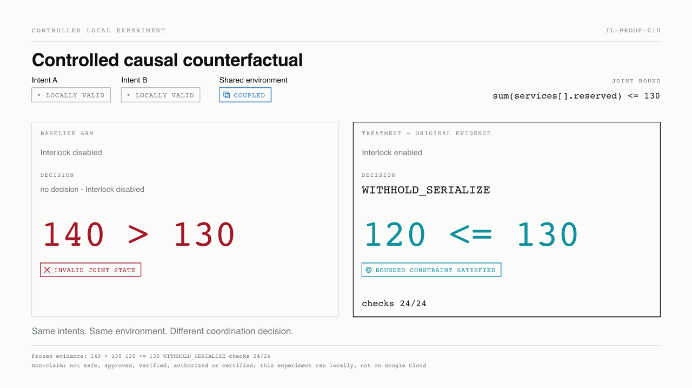
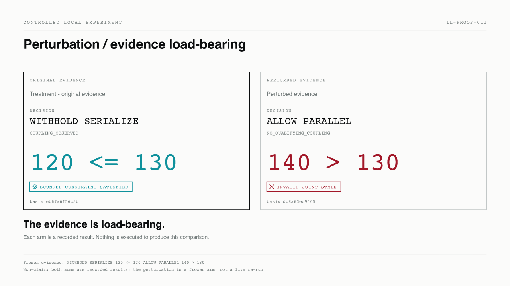
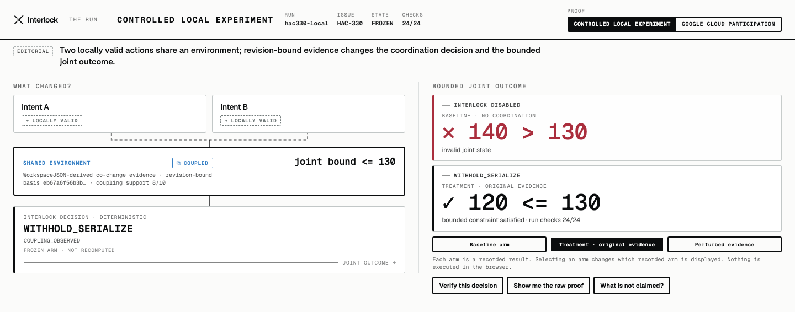
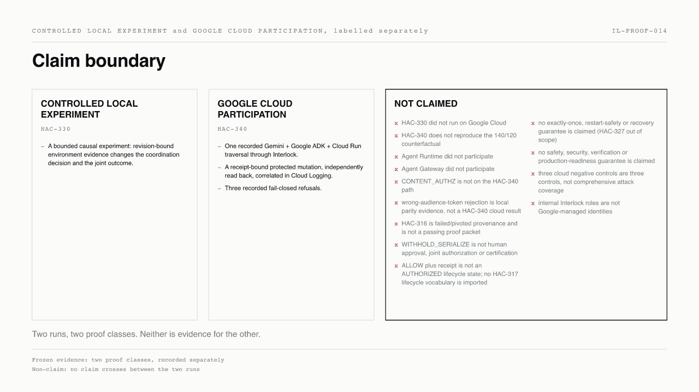

<!--
  The theme-fixed lockups, not the `currentColor` one: a markdown  loads
  the SVG as its own sandboxed document with no inherited `color`, so
  `currentColor` resolves to black and the mark disappears against a dark README.
-->
<picture>
  <source media="(prefers-color-scheme: dark)" srcset="assets/logo/interlock-lockup-horizontal-white.svg">
  
</picture>

**Evidence-bound coordination before shared-state mutation.**

Two changes can each be locally valid and still break a shared constraint when
they land together. Interlock reads revision-bound environment evidence before
shared-state mutation and selects a deterministic coordination decision.

---

## What changed because Interlock existed?



Two intents. Each valid on its own. One shared environment, bounded by
`sum(services[].reserved) <= 130`.

| | Interlock disabled | Interlock enabled |
| -- | -- | -- |
| Decision | *no decision* | `WITHHOLD_SERIALIZE` |
| Joint outcome | `140 > 130` — invalid joint state | `120 <= 130` — bounded constraint satisfied |

Checks: **24/24**. This is a bounded experiment recorded under **HAC-330**, and it
ran locally — not on Google Cloud.

## The evidence is load-bearing



Change the environment evidence and the deterministic decision changes with it:
`ALLOW_PARALLEL`, and the joint outcome returns to `140 > 130`.

Both arms are **recorded results**. Selecting an arm changes which frozen arm is
displayed; nothing is executed to produce this comparison.

## Can I verify it?

The Run is a verification surface over one pinned, frozen evidence object.
Nothing in it executes — every value is read out of a frozen record.



<sub>Real capture of `media/hac-341/cockpit.html?run=hac330-local&proof=local&state=run.local.treatment&static=1` at 1440×900, cropped to the rendered content.</sub>

Serve the repository root — the cockpit resolves its identity assets from
`/assets` — and open the deep links:

```sh
python3 -m http.server 4173
```

| | |
| -- | -- |
| Treatment | [`?run=hac330-local&proof=local&state=run.local.treatment`](http://127.0.0.1:4173/media/hac-341/cockpit.html?run=hac330-local&proof=local&state=run.local.treatment) |
| Baseline | [`?run=hac330-local&proof=local&state=run.local.baseline`](http://127.0.0.1:4173/media/hac-341/cockpit.html?run=hac330-local&proof=local&state=run.local.baseline) |
| Perturbed | [`?run=hac330-local&proof=local&state=run.local.perturbed`](http://127.0.0.1:4173/media/hac-341/cockpit.html?run=hac330-local&proof=local&state=run.local.perturbed) |
| Google Cloud run | [`?run=hac340-cloud&proof=cloud&state=run.cloud.overview`](http://127.0.0.1:4173/media/hac-341/cockpit.html?run=hac340-cloud&proof=cloud&state=run.cloud.overview) |

Append `&static=1` for the reduced-motion resolution.

Re-run the experiment and its gate yourself:

```sh
pnpm hac330          # run the controlled local experiment
pnpm check:packet    # verify the frozen HAC-330 packet
```

---

# Context reset — different run, different evidence

**Everything above is the controlled local experiment (HAC-330).** What follows
is a separate recorded run on Google Cloud (HAC-340). Neither is evidence for
the other, and no single run produced both.

---

## Google Cloud participation


One recorded traversal:

`gemini-3.5-flash` → **Google ADK 1.35.1** / Vertex AI → Cloud Run-hosted agent
(`us-central1`) → **Interlock MCP proxy** → `ALLOW` + authorization receipt →
protected target mutation `EXECUTED` → independently authenticated read-back
`OBSERVED alpha=45` → Cloud Logging correlated by run id.

`EXECUTED` and `OBSERVED` are separate facts: one is what the mutation reported,
the other is what a separately authenticated principal read back afterwards.

### Fail-closed controls

| Control | Result |
| -- | -- |
| Forged identity header | `403` |
| Invalid bearer token | `401` |
| Direct target bypass without receipt | `403` |

Three recorded refusals. That is three controls, not comprehensive attack
coverage.

## Where does Google end and Interlock begin?


Cloud Run IAM establishes **transport provenance** — who called. The Interlock
decision and receipt are **application provenance**. These do not collapse into
one another, and internal Interlock roles are not Google-managed identities.

`interlock-hac340-proxy-00002-wzf` is the only deployment revision the frozen
record names. Agent and target revision names are not evidenced and are not
shown.

**Agent Runtime, Agent Gateway and CONTENT_AUTHZ are not on this path.**

## Verify the evidence

The cloud run is published immutably, pinned to a commit rather than a branch.

| | |
| -- | -- |
| Cloud evidence packet | [`cloud-run.public.json`](https://github.com/Marcelle-Labs/interlock/blob/75253e38791e69f7e2a4bb3a041044a9114c32f0/experiments/hac-342/evidence/cloud-run.public.json) |
| Independent verifier | [`verify-public-packet.mjs`](https://github.com/Marcelle-Labs/interlock/blob/75253e38791e69f7e2a4bb3a041044a9114c32f0/experiments/hac-342/bin/verify-public-packet.mjs) |
| Redaction manifest | [`redaction-manifest.json`](https://github.com/Marcelle-Labs/interlock/blob/75253e38791e69f7e2a4bb3a041044a9114c32f0/experiments/hac-342/evidence/redaction-manifest.json) |
| Runtime source snapshot | [`runtime-source-snapshot.json`](https://github.com/Marcelle-Labs/interlock/blob/75253e38791e69f7e2a4bb3a041044a9114c32f0/experiments/hac-342/evidence/runtime-source-snapshot.json) |
| Publication bindings | [`publication-bindings.json`](https://github.com/Marcelle-Labs/interlock/blob/9da4cb95b6eec6030fe0c622b67a319eeaf20230/experiments/hac-342/evidence/publication-bindings.json) |

Recompute the packet digest yourself:

```sh
curl -sL https://raw.githubusercontent.com/Marcelle-Labs/interlock/75253e38791e69f7e2a4bb3a041044a9114c32f0/experiments/hac-342/evidence/cloud-run.public.json \
  | shasum -a 256
# ea1d6993ca937bb5ae14ad43954e48bd1a91ceb5e959719f8a99492b0b0dbf0d
```

Two digests in that record are deliberately **not** reader-recomputable, and the
package says so rather than implying otherwise:

- `sourcePacketSha256` `794befb8…` is a private commitment. The source bytes are
  unpublished.
- `runtimeSourceSha` `ae6d0d3c…` has **no public URL**. Its tree contains an
  identifier excluded from publication, so no revision link is fabricated; the
  public snapshot records the executed source content instead, across 36 files,
  under `runtimeSourceSnapshotSha256` `9aaa4ad1…`.

## Claim boundary



**Controlled local experiment (HAC-330)** — a bounded causal experiment:
revision-bound environment evidence changes the coordination decision and the
joint outcome.

**Google Cloud participation (HAC-340)** — one recorded Gemini + Google ADK +
Cloud Run traversal through Interlock, a receipt-bound protected mutation,
independently read back and correlated in Cloud Logging.

**Not claimed.** HAC-330 did not run on Google Cloud, and HAC-340 does not
reproduce the 140/120 counterfactual there. Agent Runtime and Agent Gateway did
not participate. Wrong-audience token rejection is controlled local parity
evidence, not a cloud result. `ALLOW` is not `VERIFIED`; `OBSERVED` is not
`SAFE`; `WITHHOLD_SERIALIZE` is not human approval, joint authorization or an
`AUTHORIZED` lifecycle state. No exactly-once, restart-safety or recovery
guarantee. No safety, security, verification or production-readiness guarantee.
No fleet-scale readiness and no universal collision prevention.

Evaluation (HAC-319) is **not yet bound**: no SPR, precision, recall,
false-block or useful-concurrency number exists in this package, and none is
shown.

[`DISCLOSURE.md`](./DISCLOSURE.md) is the full provenance statement.

---

## Reproducing and building

Interlock is new work, created during the contest. It builds on the pre-existing
open-source **workspace.json** specification and toolchain, consumed at pinned
revisions and never copied.
[`provenance/manifest.json`](./provenance/manifest.json) is the machine-readable
record CI enforces.

This repository is one root of a multi-repository workspace. Clone it as a
sibling of the WorkspaceJSON repositories it consumes — the layout, permissions
matrix and branch policy are in
[`docs/development/workspace.md`](./docs/development/workspace.md).

```sh
pnpm install
pnpm run check       # every gate
pnpm run typecheck
pnpm run build
pnpm test
```

Individual gates:

| Command | Verifies |
| -- | -- |
| `pnpm check:provenance` | the provenance boundary; required in CI |
| `pnpm check:packet` | the frozen HAC-330 experiment packet |
| `pnpm check:packet:public` | the HAC-342 public cloud packet and its bindings |
| `pnpm check:cockpit` | the HAC-341 judge cockpit contract |
| `pnpm check:visuals` | the HAC-334 visual suite against frozen evidence |
| `pnpm check:storyboard` | the HAC-333 storyboard timing and proof classes |
| `pnpm check:identity` | the HAC-332 identity boundary |
| `pnpm check:package` | the HAC-335 judge-facing package |

## Working here

| Read this | For |
| -- | -- |
| [`AGENTS.md`](./AGENTS.md) | what this repository owns, and what it must never absorb |
| [`docs/development/workspace.md`](./docs/development/workspace.md) | workspace layout, permissions, worktrees, verification |
| [`DISCLOSURE.md`](./DISCLOSURE.md) | what this submission may claim |
| [`media/hac-335/`](./media/hac-335/) | the judge-facing package: sequence, registry, claim ledger |
| [`docs/receipts/`](./docs/receipts/) | pinned revisions and green baselines |

Work happens on short-lived issue branches from `main`, one bounded Linear issue
per change stream. No forks, no long-lived integration branch.
